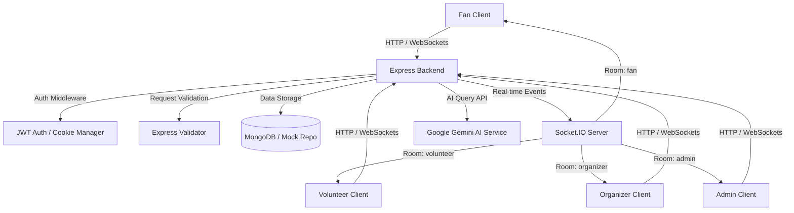

# StadiumIQ AI 🏟️🤖

StadiumIQ AI is a production-grade, GenAI-enabled stadium operations and crowd management platform designed to enhance the overall tournament experience for fans, volunteers, organizers, and venue administrators during the **FIFA World Cup 2026**.

Using advanced Generative AI assistant nodes, interactive Google Maps wayfinding layers, real-time WebSocket messaging, and role-based operational dashboards, the platform optimizes crowd flow, streamlines accessibility assistance, resolves lost-and-found claims, and dispatches real-time emergency services.

---

## 🏗️ System Architecture

---

## 🌟 Key GenAI Features

StadiumIQ AI embeds context-aware **Google Gemini AI** features across all role interfaces:
1. **Interactive AI Assistant**: Resolves queries regarding match schedules, ticketing details, and general stadium guidelines.
2. **AI Navigation Guard**: Provides step-by-step directions emphasizing accessibility ramp entries and low-congestion exits.
3. **AI Transit Guide**: Suggests schedules, coordinates shuttle transfers, and guides parking reservations.
4. **AI Food Recommender**: Recommends options matching dietary selections (vegan, halal, gluten-free).
5. **AI Accessibility Advisor**: Highlights lifts, accessible restrooms, and wheelchair support locations.
6. **AI EmergencyEvac Advisor**: Gives calm, quick directions to the nearest exits during medical or security incidents.

---

## 🌐 Real-time Operational Rooms (WebSockets)

StadiumIQ AI leverages role-specific **Socket.IO** rooms to handle operational broadcasts:
- **`fan`**: Receives match updates, general announcements, and crowd-congestion alerts.
- **`volunteer`**: Receives real-time assigned tasks and local emergency SOS signals.
- **`organizer`**: Receives live crowd metrics, active volunteer statistics, and emergency alerts.
- **`admin`**: Full real-time operational monitor, receives crowd reports, volunteer updates, and active SOS signals.

---

## 📍 Interactive Map Wayfinding

The Google Maps integration (`client/src/components/Map.tsx`) includes:
- **Marker Control Sidebar**: Toggle markers for gates, parking, dining, medical rooms, and accessible paths.
- **Interactive Routes**:
  - **Seat Finder**: Section B seats directions.
  - **Access Pathway**: Step-free access routes.
  - **Emergency Evacuation**: Evacuation routes to safe zones.

---

## 🔒 Security Posture

- **Helmet**: Production CSP directive rules ensuring script and style whitelisting.
- **Rate-Limiting**: IP-based rate limiter guarding all `/api` endpoints.
- **NoSQL Injection Guard**: Parameter validation via Mongoose schemas.
- **Secure Cookies**: HttpOnly and SameSite cookies containing JWT session refresh tokens.
- **Auth Guards**: Role checks protecting page routing.
