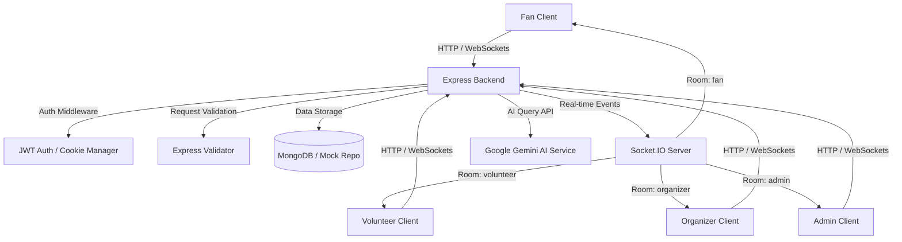

# StadiumIQ AI 🏟️🤖

StadiumIQ AI is a production-grade, GenAI-enabled stadium operations and crowd management platform designed to enhance the overall tournament experience for fans, volunteers, organizers, and venue administrators during the **FIFA World Cup 2026**.

Using advanced Generative AI assistant nodes, interactive mapping wayfinding layers, real-time WebSocket messaging, and role-based operational dashboards, the platform optimizes crowd flow, streamlines accessibility assistance, resolves lost-and-found claims, and dispatches real-time emergency services.

---

## 🏗️ System Architecture



---

## 🌟 Key GenAI Features

StadiumIQ AI embeds context-aware **Google Gemini AI** features across all role interfaces:
1. **Interactive AI Assistant**: Resolves queries regarding match schedules, ticketing details, and general stadium guidelines.
2. **AI Navigation Guard**: Provides step-by-step directions emphasizing accessibility ramp entries and low-congestion exits.
3. **AI Transit Guide**: Suggests schedules, coordinates shuttle transfers, and guides parking reservations.
4. **AI Food Recommender**: Recommends options matching dietary selections (vegan, halal, gluten-free).
5. **AI Accessibility Advisor**: Highlights lifts, accessible restrooms, and wheelchair support locations.
6. **AI EmergencyEvac Advisor**: Gives calm, quick directions to the nearest exits during medical or security incidents.

---

## 🌐 Real-time Operational Rooms (WebSockets)

StadiumIQ AI leverages role-specific **Socket.IO** rooms to handle operational broadcasts:
- **`fan`**: Receives match updates, general announcements, and crowd-congestion alerts.
- **`volunteer`**: Receives real-time assigned tasks and local emergency SOS signals.
- **`organizer`**: Receives live crowd metrics, active volunteer statistics, and emergency alerts.
- **`admin`**: Full real-time operational monitor, receives crowd reports, volunteer updates, and active SOS signals.

---

## 📍 Interactive Map Wayfinding

The mapping integration includes:
- **Marker Control Sidebar**: Toggle markers for gates, parking, dining, medical rooms, and accessible paths.
- **Interactive Routes**:
  - **Seat Finder**: Section B seats directions.
  - **Access Pathway**: Step-free access routes.
  - **Emergency Evacuation**: Evacuation routes to safe zones.
- **Alternative Free Mode**: Supports an out-of-the-box OpenStreetMap + Leaflet mode, bypassing paywalled Google/Mapbox APIs.

---

## 🔒 Security Posture

- **Helmet**: Production CSP directive rules ensuring script and style whitelisting.
- **Rate-Limiting**: IP-based rate limiter guarding all `/api` endpoints.
- **NoSQL Injection Guard**: Parameter validation via Mongoose schemas.
- **Secure Cookies**: HttpOnly and SameSite cookies containing JWT session refresh tokens.
- **Auth Guards**: Role checks protecting page routing.

---

## 🛠️ Technology Stack

* **Frontend**: React (v19), TypeScript, Tailwind CSS, Wouter (Routing), Lucide React (Icons), Radix UI (Primitives)
* **Backend**: Node.js, Express, TypeScript, tsx, Socket.IO, Mongoose, JWT (jsonwebtoken)
* **Database**: MongoDB (Mongoose) with an automatic In-Memory fallback mode.
* **AI Service**: Google Gemini (generativelanguage.googleapis.com)
* **Build Tools**: Vite (v7), Esbuild, Prettier

---

## 📂 Folder Structure

```text
stadium-iq-ai/
├── .github/workflows/   # CI/CD pipelines
│   └── ci.yml           # GitHub Actions workflow
├── client/              # Frontend React application
│   ├── index.html       # Entry HTML file
│   ├── public/          # Static assets
│   └── src/
│       ├── api/         # Axios client setup
│       ├── components/  # Shared components (Map, Navigation, etc.)
│       ├── contexts/    # Auth & Theme providers
│       ├── hooks/       # Custom React hooks
│       ├── pages/       # Role dashboards & feature pages
│       ├── services/    # Frontend API request abstractions
│       └── index.css    # Global Tailwind styles
├── server/              # Backend Node.js Express application
│   ├── config/          # DB connection & database seeding
│   ├── controllers/     # Route logic controllers
│   ├── middleware/      # Auth, error, rate-limiting, and validation middlewares
│   ├── models/          # Mongoose database schemas
│   ├── repositories/    # Database repository abstractions (with Mock mode)
│   ├── routes/          # Express API route declarations
│   ├── services/        # AI, auth, and business logic services
│   ├── utils/           # API response helpers and socket utilities
│   └── index.ts         # Main server entrypoint
├── shared/              # Shared constants and configurations
└── package.json         # Scripts and dependencies
```

---

## 🚀 Installation & Running Locally

For complete installation steps, database creation, environment variable instructions, and running details:
* Please read the **[Installation & Running Guide](file:///c:/Users/OM%20TRIVEDI/Desktop/promptwar%204/running_guide.md)**.
* Please review all available API endpoints in the **[API Documentation](file:///c:/Users/OM%20TRIVEDI/Desktop/promptwar%204/API_Documentation.md)**.
* Review production deployment configurations in the **[Deployment Guide](file:///c:/Users/OM%20TRIVEDI/Desktop/promptwar%204/Deployment_Guide.md)**.

### Quick Start
1. Install dependencies:
   ```bash
   pnpm install
   ```
2. Start the backend:
   ```bash
   pnpm run dev:server
   ```
3. Start the frontend:
   ```bash
   pnpm run dev
   ```

---

## 🚀 Hackathon Quick Judging (Demo Mode)

We have built a **one-click Demo Mode** for judges:
1. Open the login screen at `http://localhost:3000/login`.
2. Scroll to the **Demo Quick Login** panel.
3. Click any role button (Fan, Volunteer, Organizer, Admin) to instantly sign in and explore the pre-seeded maps, AI chat history, SOS alerts, and operational data.

---

## 📄 License
This project is licensed under the MIT License - see the LICENSE file for details.
